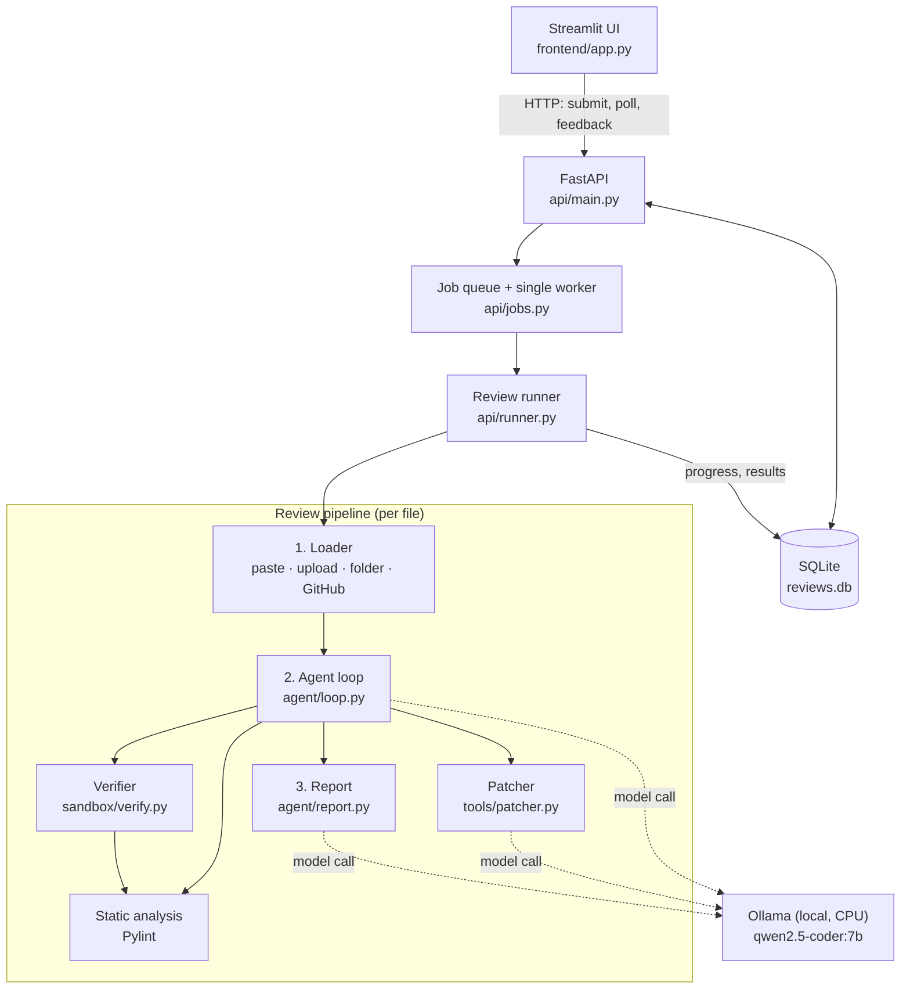
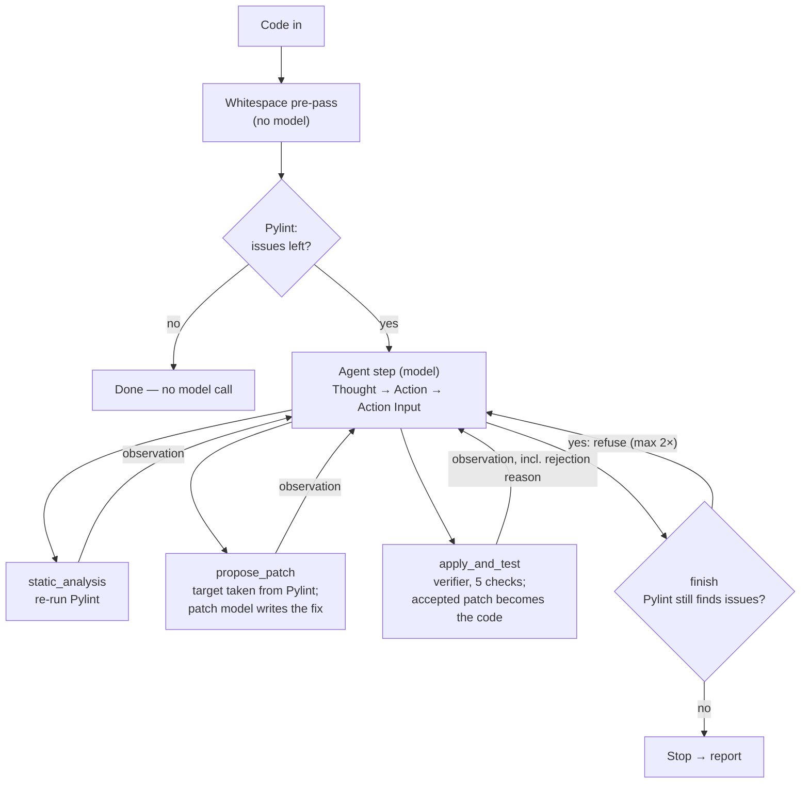

# AI-Driven Code Review and Refactoring Framework

An AI agent that reviews Python code, finds real issues with static analysis, and uses a **local small language model (SLM)** to propose fixes — then **accepts a fix only after a deterministic verifier proves it is real**.

Everything runs on a single laptop: no cloud APIs, no GPU, and source code never leaves the machine.

---

## Table of Contents

1. [Project Overview & Architecture](#1-project-overview--architecture)
2. [Tech Stack](#2-tech-stack)
3. [Development Status](#3-development-status)
4. [Prerequisites](#4-prerequisites)
5. [Local Setup & Execution Guide](#5-local-setup--execution-guide)
6. [Using the Application](#6-using-the-application)
7. [API Reference](#7-api-reference)
8. [Configuration](#8-configuration)
9. [Testing](#9-testing)
10. [Performance](#10-performance)
11. [Project Structure](#11-project-structure)
12. [Known Limitations](#12-known-limitations)
13. [Troubleshooting](#13-troubleshooting)

---

## 1. Project Overview & Architecture

### The problem

Language models are good at *proposing* code changes but unreliable at *reporting* them. During development, the model used here was repeatedly observed:

- returning code **identical** to the input while claiming it had added docstrings;
- **renaming functions** while "fixing" an unrelated issue, which would break every caller;
- declaring a review **finished** while issues remained;
- describing a real change as **"no changes were made"**.

A review tool that trusts these claims silently produces wrong results.

### The core idea: a deterministic safety gate

The model is only ever allowed to **suggest**. Every decision that matters is made by ordinary, deterministic code:

| Decision | Made by | Never by |
| --- | --- | --- |
| What is wrong with the code | Pylint | The model |
| Which issue a patch is meant to fix | Pylint findings, matched to the model's request | The model's (often malformed) tool input |
| Whether a patch is accepted | The verifier (5 checks, below) | The model's own claim |
| Whether the review is finished | Finish guard (re-runs Pylint) | The model saying "done" |
| Whether the explanation is accurate | Explanation check against the actual diff | The model's description |

Only patches that pass every check are kept, and each accepted patch becomes the base for the next one, so fixes accumulate safely.

### Verification checks

A patch is rejected by the first check it fails, with a named reason that is fed back to the agent:

| # | Check | Rejects when | Reason code |
| --- | --- | --- | --- |
| 1 | Syntax integrity | The patch does not parse as Python (`ast.parse`) | `syntax_error` |
| 2 | Real change | The patch is identical to the original | `no_change` |
| 3 | Definitions preserved | Any function or class name was removed or renamed | `definition_removed` |
| 4 | Target fixed | Pylint still reports the rule the patch was meant to fix | `issue_not_fixed` |
| 5 | Net improvement | The total number of Pylint findings did not decrease | `no_improvement` |

The final plain-English explanation is checked the same way: it is rejected if it claims "no changes" for a non-empty diff, or mentions docstrings, imports or renames that the diff does not contain. The model then gets one retry; if it fails again, a factual summary built from the diff and Pylint results is used instead.

### System architecture



Only three components call the model (dotted lines). The static analyser and verifier that judge its output contain no model calls.

### Agent loop (one file)



The loop also stops on unreadable model output, on an exact repeat of an earlier action, or after 8 steps.

---

## 2. Tech Stack

| Layer | Technology |
| --- | --- |
| Language | Python 3.10+ (developed on 3.13) |
| LLM inference | [Ollama](https://ollama.com), running local SLMs on CPU |
| Models | `qwen2.5-coder:7b`, specialised into two roles by Ollama Modelfiles: **`qwen-refactor-7b`** (agent: chooses tools in ReAct format) and **`qwen-baseline-7b`** (writes patches and explanations). Both share the same base weights; no fine-tuning is involved. |
| Static analysis | Pylint |
| Backend API | FastAPI + Uvicorn, with a background job queue and a single worker thread |
| Persistence | SQLite via SQLAlchemy (`reviews.db`) |
| Frontend | Streamlit |
| Repository fetching | GitPython |

---

## 3. Development Status

**Overall progress: ~65%.** The core review pipeline, its safety layer, the backend, persistence and a working web UI are complete and tested with the real model. The remaining work is mainly evaluation, using the collected feedback, and improving the user experience.

### ✅ Completed

- [x] **Code collection** — pasted code, `.py` file upload, local directories, and GitHub repository cloning
- [x] **Static analysis** — Pylint integration returning structured findings (line, type, rule, message)
- [x] **SLM refactoring agent** — ReAct loop that fixes one issue at a time, building each patch on the last accepted one
- [x] **Deterministic verifier & safety gate** — syntax integrity, function/class preservation, target-issue re-check, net reduction in Pylint findings
- [x] **Finish guard** — refuses a premature "done" while Pylint still reports issues
- [x] **Explanation verification** — the final explanation is checked against the actual diff, with a retry and a factual fallback
- [x] **Robust parsing of model output** — recovers single-quoted and re-stringified (nested) tool input; targets are always resolved against real Pylint findings
- [x] **Verification evidence & regression tests** — real model failures captured as fixtures and replayed by model-free tests
- [x] **Backend API** — FastAPI with background job queue, live progress, queue position and worker health
- [x] **Database** — SQLite persistence for reviews, findings, patches and feedback; interrupted reviews are detected after a restart
- [x] **Web UI** — Streamlit page for submission, live status, side-by-side original/corrected code, diff, explanation and 👍/👎 feedback

### 🚧 Remaining (~35%)

- [ ] **Feedback loop** — analyse stored 👍/👎 ratings per rule and per fix type, and feed the results back into fix hints and prompt design
- [ ] **Frontend improvements**
  - [ ] Submit a local folder or GitHub URL from the UI (the API already supports both)
  - [ ] Multi-file review dashboard: per-file status, totals, filtering
  - [ ] Download the corrected file and an exportable review report (Markdown/PDF)
  - [ ] Inline, colour-highlighted diff view and clearer explanations for non-developers
  - [ ] Search and filter in review history
- [ ] **Evaluation & benchmarking** — run a fixed set of real files, report fix rate, rejection reasons and time per issue, and record end-to-end demonstrations
- [ ] **Performance** — shorten prompts (the agent history currently repeats the full code at every step) and cap issues per file
- [ ] **Agent robustness** — stop the model copying code into its tool input (unescaped `"""` still causes occasional unreadable input), and add fix hints for structural rules such as `consider-using-enumerate`
- [ ] **Test consolidation** — move the model-free regression scripts into a single `pytest` suite

---

## 4. Prerequisites

| Software | Version | Download | Purpose |
| --- | --- | --- | --- |
| Python | 3.10 or higher | https://www.python.org/downloads/ | Runs the project |
| Git | Any recent version | https://git-scm.com/downloads | Cloning this repository and GitHub repos for review |
| Ollama | Latest | https://ollama.com/download | Runs the language models locally |
| VS Code *(recommended)* | Latest | https://code.visualstudio.com/ | Editing and running the project |

**Hardware:** 16 GB RAM is recommended. No GPU is required — all inference runs on the CPU. The base model needs about **4.7 GB** of disk space.

> On Windows, tick **"Add python.exe to PATH"** in the Python installer.

---

## 5. Local Setup & Execution Guide

### Step 1 — Clone the repository

```bash
git clone https://github.com/AminaShahid786/code-review-agent.git
cd code-review-agent
```

### Step 2 — Create and activate a virtual environment

```bash
python -m venv venv
```

```bash
# Windows (PowerShell)
venv\Scripts\activate

# Linux / macOS
source venv/bin/activate
```

> Always activate the virtual environment before running the backend. The agent invokes `pylint` by name, so it must be on the `PATH`.

### Step 3 — Install dependencies

```bash
pip install -r requirements.txt
```

### Step 4 — Download the base model and create the two role models

Make sure Ollama is running (it starts automatically after installation; otherwise run `ollama serve`), then:

```bash
ollama pull qwen2.5-coder:7b
ollama create qwen-refactor-7b -f Modelfile-refactor7b
ollama create qwen-baseline-7b -f Modelfile-baseline7b
```

Verify:

```bash
ollama list
```

You should see `qwen2.5-coder:7b`, `qwen-refactor-7b` and `qwen-baseline-7b`. The two `create` commands are instant: they reuse the downloaded weights and only add a role-specific system prompt.

### Step 5 — Start the backend API

From the project root, with the virtual environment active:

```bash
uvicorn api.main:app --port 8000
```

The terminal should show `Review worker started`. Check that everything is ready at http://127.0.0.1:8000/health:

```json
{"pylint_on_path": true, "ollama_running": true, "fake_llm": false,
 "worker": {"alive": true, "current_job": null, "queued_jobs": 0}}
```

Interactive API documentation is available at http://127.0.0.1:8000/docs.

### Step 6 — Start the frontend (in a new terminal)

```bash
# activate the virtual environment again in this terminal, then:
streamlit run frontend/app.py
```

### Step 7 — Open the application

Go to **http://localhost:8501**. The sidebar shows whether Pylint, Ollama and the review worker are ready.

> **Try it without the models.** Start the API with `REVIEW_FAKE_LLM=1` to replace the model with an instant stand-in. Pylint, the verifier and all safety checks still run for real, so the full UI can be explored in seconds (the stand-in never produces fixes).
>
> ```powershell
> # Windows (PowerShell)
> $env:REVIEW_FAKE_LLM="1"; uvicorn api.main:app --port 8000
> ```
> ```bash
> # Linux / macOS
> REVIEW_FAKE_LLM=1 uvicorn api.main:app --port 8000
> ```

---

## 6. Using the Application

1. **Submit code** — paste Python code (with an optional file name) or upload a `.py` file, then click **Start review**.
2. **Watch progress** — the page refreshes every 5 seconds, showing queue position, current step, number of model calls and elapsed time. You can close the page; the review continues and appears under **Past reviews** in the sidebar.
3. **Read the results** — for each file:
   - summary of how many issues were fixed and confirmed by Pylint;
   - table of every finding, marked ✅ fixed or ❌ still open;
   - original and corrected code side by side, followed by the diff;
   - the explanation, with a note on whether it passed the diff check first time;
   - the agent's individual steps (collapsed).
4. **Give feedback** — 👍 or 👎 with an optional comment. Ratings are stored in the database.

Reviews run **one at a time**: on CPU-only hardware a single model call takes 15 seconds to 3 minutes, so a second submission waits in the queue and shows which review it is waiting for. Submitting the same code twice within 30 seconds opens the existing review rather than starting a duplicate.

---

## 7. API Reference

| Method | Endpoint | Description | Response |
| --- | --- | --- | --- |
| `POST` | `/reviews` | Submit `{"source_type": "code", "code": "..."}`, `{"source_type": "folder", "path": "..."}` or `{"source_type": "github", "url": "...", "branch": "main"}` | `202` with job `id` and `poll_url` |
| `POST` | `/reviews/upload` | Submit one `.py` file as multipart form data (`file`) | `202` with job `id` and `poll_url` |
| `GET` | `/reviews/{id}` | Status (`queued`, `running`, `done`, `failed`), live progress, per-file results and feedback | Job record |
| `GET` | `/reviews` | All reviews, newest first, without per-file results | List |
| `POST` | `/reviews/{id}/feedback` | `{"rating": "up" \| "down", "filepath": "...", "comment": "..."}` | `201` with the stored entry |
| `GET` | `/health` | Pylint availability, Ollama status, worker state | Status flags |

Example:

```bash
curl -X POST http://127.0.0.1:8000/reviews \
  -H "Content-Type: application/json" \
  -d '{"source_type": "code", "code": "def calc(a, b, c):\n    x = a + b\n    return x * c\n"}'
```

---

## 8. Configuration

All settings are optional environment variables.

| Variable | Default | Used by | Effect |
| --- | --- | --- | --- |
| `REVIEW_FAKE_LLM` | unset | API | `1` replaces the model with an instant stand-in (testing only) |
| `REVIEW_DB` | `reviews.db` | API | Path of the SQLite database file |
| `REVIEW_MAX_FILES` | `10` | API | Maximum `.py` files per folder or repository submission |
| `REVIEW_API_URL` | `http://127.0.0.1:8000` | Frontend | Address of the backend API |
| `SLM_MODEL` | `qwen-refactor-7b` | Agent | Default model when a call does not name one |

Folders named `venv`, `.venv`, `.git`, `site-packages`, `__pycache__` and `node_modules` are skipped when loading a folder or repository.

---

## 9. Testing

The regression tests below need **no model and no Ollama**. They replay real model output captured in `tests/fixtures/`, so known failures cannot silently return.

| Command | What it verifies | Time |
| --- | --- | --- |
| `python test_verify_gap.py` | The verifier rejects identical, renamed, non-fixing and non-improving patches, and accepts real fixes | ~20 s |
| `python test_parse_gap.py` | Malformed and nested model tool input is recovered; the verifier checks the issue the model actually targeted | ~15 s |
| `python test_explanation_gap.py` | Explanations that contradict the diff are caught, retried, or replaced | ~10 s |
| `python test_db.py` | Reviews, findings, patches and feedback persist across a restart; interrupted reviews are marked failed | ~5 s |
| `python test_frontend.py` | The UI drives a real API server end to end: submission, live status, results, feedback, double-click protection | ~25 s |

Run them from the project root with the virtual environment active. Other `test_*.py` scripts in the root call the real model and take several minutes each.

---

## 10. Performance

Measured on a Windows laptop with 16 GB RAM and no GPU:

| Input | Issues | Resolved | Model calls | Time |
| --- | --- | --- | --- | --- |
| Small function, 2 missing docstrings | 2 | 2 / 2 | 9 | ~10.5 min |
| `buggy_math.py` | 5 | 5 / 5 | 12 | ~30 min |
| `messy_loops.py` | 7 | 5 / 7 (step budget reached) | 13 | ~32 min |

Typical model call: ~100 s for the agent model, 15–35 s for the patch model. Throughput, not correctness, is the main constraint, which is why reviews are processed as background jobs.

---

## 11. Project Structure

```text
code-review-agent/
├── adapters/
│   └── loader.py            # Load .py files from a folder or a cloned GitHub repo
├── agent/
│   ├── llm.py               # Streaming calls to Ollama
│   ├── loop.py              # ReAct agent loop, target resolution, finish guard
│   ├── parser.py            # Parses Thought / Action / Action Input from model output
│   ├── prompts.py           # Agent prompt construction
│   └── report.py            # Diff, fixed-issue summary, verified explanation
├── api/
│   ├── main.py              # FastAPI endpoints
│   ├── jobs.py              # Job queue, background worker, storage functions
│   ├── runner.py            # Runs one review job through the pipeline
│   └── db.py                # SQLAlchemy models (reviews, patches, findings, feedback)
├── frontend/
│   └── app.py               # Streamlit user interface
├── sandbox/
│   └── verify.py            # Deterministic patch verifier
├── tools/
│   ├── analysis.py          # Pylint wrapper
│   └── patcher.py           # Single-issue patch generation with fix hints
├── tests/fixtures/          # Real review results used by the regression tests
├── sample_repos/            # Example Python files for trying the agent
├── Modelfile-refactor7b     # Ollama Modelfile: agent role
├── Modelfile-baseline7b     # Ollama Modelfile: patch and explanation role
├── verification_gap_evidence.md  # Recorded real runs and verifier results
├── test_*.py                # Regression and manual test scripts
└── requirements.txt
```

---

## 12. Known Limitations

- **Speed.** CPU-only inference makes a single file take roughly 10–40 minutes; reviews run one at a time.
- **Step budget.** The agent has 8 steps per file. Files with many issues, or structural issues such as `consider-using-enumerate`, can end partly fixed. Unfixed issues are reported honestly as still open.
- **Occasional unreadable tool input.** The model sometimes copies code containing unescaped `"""` into its JSON tool input. This does not block a review: the loop uses its own stored patch and resolves the target from Pylint and the model's stated reasoning, falling back to the first remaining finding if neither identifies it.
- **Pylint as ground truth.** The verifier confirms that Pylint findings are resolved and that no function or class disappeared. It does not prove behavioural equivalence unless a test suite is supplied to the verifier.
- **Explanation checks are targeted.** They catch specific false claims (no change, docstrings, imports, renames); they cannot prove every sentence is true.
- **Interrupted reviews are not resumed.** If the server stops mid-review, the review is marked `failed` on the next start, with any completed files kept; it must be resubmitted.

---

## 13. Troubleshooting

| Symptom | Cause | Fix |
| --- | --- | --- |
| `/health` shows `"pylint_on_path": false` | Virtual environment not activated | Activate `venv`, then restart Uvicorn |
| `/health` shows `"ollama_running": false` | Ollama is not running | Start the Ollama app or run `ollama serve` |
| `model 'qwen-refactor-7b' not found` | Role models not created | Run the two `ollama create` commands in Step 4 |
| A review stays `queued` | Another review is running (one at a time) | Check `waiting_for` in `GET /reviews/{id}` or `worker.current_job` in `/health` |
| The UI says it cannot reach the API | Backend not running, or on another port | Start Uvicorn on port 8000, or set `REVIEW_API_URL` |
| A review shows `failed: Interrupted…` | The server stopped while it was running | Submit it again |
